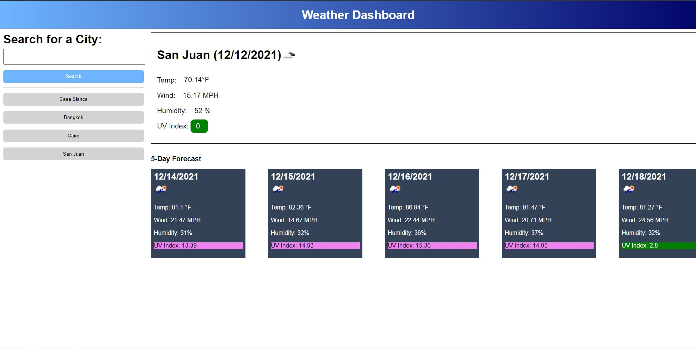

# Weather Dashboard

[Live App](https://ddoherty6.github.io/06-Weather-Dashboard/)

This application allows the user to search for a city and see the current weather there, along with a five day forecost.

 

## Criteria

- Searching for a city provides the current weather information and a five day forecast for that city.
- Once a city is searched, it appears as a button in the search history to allow for easy search in the future.

## Development

In past challenges, I have made use of objects to split the code logically into different sections. This time, I went with a series of functions. In an app this size, the difference in readablity is minimal. Though if I were to refactor the code, having a user input object, an object for interacting with the API, an object for interacting with localStorage, and object for writing the info onto the page would allow for better future expansion. Also needed is a delete button, or clear button, for the search history. I also decided to add the UV Index data to each forecast article, as this was easy to implement. The styling on UV Index in the five-day forecast could use improvement, but this works well as an MVP.

I decided not to use jQeury at all, more as a challenge than anything else. There are a few times where it would have been very useful for selecting elements. Of note is when populating the information in the five-day forecast. As of now, the code cycles through each article horizontally, applying changes to all of the dates first, then the icons, etc. This is due to each datum's fomatting needs. drawForecast() seems to be the most difficult code to read. Especially considering the for loop dependent on infoIndex, which does not need to be there. But I felt incrementing infoIndex without wrapping everything in the for loop could lead to unforseen problems.

## Potential Improvements

As mentioned above, a delete or clear button would help greatly with functionality. In addition, the css controlling the forecast coler could use some improvement for better styling in the forecast articles. 

The page is written only for desktop use, as there was no mention of adjusting to smaller screen sizes in the critera. Adding this functionality would be a great additional feature.

The app could use better error handling - right now a simple browser alert lets the user know if a city is spelled wrong. But this assumes a few things: the API server is functioning correctly, and there are no network errors. Developing more diverse error handling will be a good addition to this app in my portfolio.

Overall, the styling could use a more personalized touch. This MVP uses the mock-up styling directly, which serves a purpose in that it is practice for matching a mock-up provided by a design team in a real-life situation.